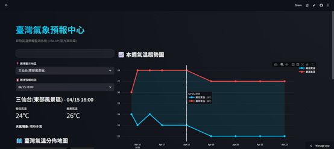
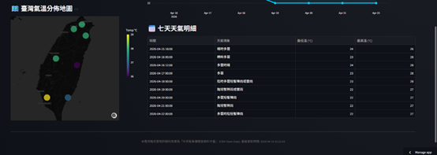

# ⛅ 臺灣一週天氣預報儀表板 (CWA Weather Dashboard)

這是一個基於 **Python** 與 **Streamlit** 開發的專業天氣監測系統。它能自動從「中央氣象署 (CWA)」擷取最新的一週天氣預報，並透過直觀的圖表與台灣導覽地圖，為使用者提供精確的氣象資訊。

## 🌐 線上展示 (Live Demo)
👉 **[點此查看即時儀表板](https://20260415weather-isapptmew56ik9c6lyazut.streamlit.app/)**

---

## 📸 介面預覽 (Showcase)

| 區域選擇與地圖導覽 | 氣溫趨勢與預報明細 |
| :---: | :---: |
|  |  |

---

## 🚀 核心特色
*   **📡 即時數據同步**：串接 CWA 官方 API `F-C0032-003` 資料集，獲取最權威的氣象資訊。
*   **📊 動態趨勢視覺化**：整合 Plotly 繪製未來七天的最高/最低溫趨勢，並具備氣溫區間著色功能。
*   **🗺️ 動態地理氣溫熱圖**：整合 Plotly Mapbox 實現動態氣溫分佈顯示，自動依據氣象數據調整色階，直觀呈現全台溫差。
*   **🔒 企業級安全性**：採用 `.env` 環境變數與 `.gitignore` 隔離敏感金鑰，確保 API Token 不外洩。
*   **⚡ 高性能資料庫**：後端整合 SQLite3 作為緩存，減少 API 呼叫頻率並提升存取速度。

## 🛠️ 技術架構
1.  **資料層 (Data Layer)**：Python 腳本 (`fetch_data.py`) 定期向 CWA API 請求資料。
2.  **儲存層 (Storage Layer)**：將解析後的 JSON 格式資料結構化存儲至 SQLite 資料庫。
3.  **應用層 (App Layer)**：Streamlit 讀取資料庫，並提供靈活的下拉式選單與互動式元件進行展示。

---

## 🔧 安裝與快速開始

### 1. 克隆專案並安裝依賴
```bash
git clone https://github.com/chhcgrrace/20260415weather.git
cd 20260415weather
pip install -r requirements.txt
```

### 2. 配置環境變數
在專案根目錄建立 `.env` 檔案，並填入您的 API 金鑰：
```env
CWA_API_KEY=您的中央氣象署授權碼
```

### 3. 初始化數據與啟動
```bash
# 抓取天氣資料
python fetch_data.py

# 啟動儀表板
streamlit run app.py
```

---

## 📂 檔案清單說明
*   `app.py`: 主要的前端 UI 開發檔案。
*   `fetch_data.py`: 核心資料抓取與處理模組。
*   `data.db`: 本地結構化天氣資料庫。
*   `requirements.txt`: 專案所需的 Python 套件清單。
*   `log.txt`: 詳細的專案開發歷程紀錄。

---

## 🛡️ 數據來源說明
本專案資料來源為 **[中央氣象署開放資料平臺](https://opendata.cwa.gov.tw/)**。
開發遵循行政院「公平、透明及利民」之開放資料原則。

---
---
Developed with ❤️ by Antigravity AI & USER.

---

## 🤖 專案生成指令 (Mega-Prompt / Blueprint)
> [!TIP]
> **想要重新複製或快速重現此專案嗎？**
> 這是一段經過多次優化後，總結出的「專案開發藍圖」。您可以將下方內容複製到任何強大的 AI 助手（如 Gemini, GPT-4），即可快速生成本專案的基礎架構。

```markdown
# Role: 專業 Python 全棧開發工程師
# Task: 建立一個臺灣一週天氣預報監測系統

## 1. 資料處理層 (fetch_data.py)
- API 串接：使用中央氣象署 API (F-C0032-003)。
- 安全性：使用 python-dotenv 管理 CWA_API_KEY。
- 資料庫：SQLite3 (Table: TemperatureForecasts)，欄位須含 (id, regionName, dataDate, mint, maxt, weather)。
- 邏輯：解析 JSON 並對齊各時段之氣溫與天氣現象，支援資料覆寫更新。

## 2. 視覺化展示層 (app.py)
- 框架：Streamlit (搭配自訂 CSS 實現深色模式與毛玻璃卡片效果)。
- 互動：側邊欄包含地區切換選單。
- 組件：
  - 左側：當前氣溫指標卡片、動態地圖 (Mapbox) 分佈展示。
  - 右側：Plotly 溫度趨勢折線圖 (含區域填充)、詳細預報 DataFrame 表格。
- 效能：直接匯入 fetch_data.py 之函式進行資料更新。

## 3. 部署準備
- 包含 requirements.txt 與 .gitignore。
- 資料庫與資料：`data.db` 應隨 Repo 提供以確保首次載入成功。
- 完善的 README.md 說明教學。
```
